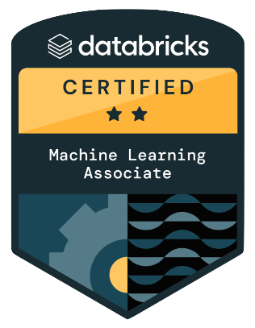
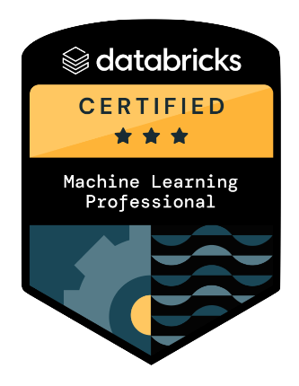

# Databricks-Certified-Machine-Learning-Associate-and-Professional

 

### Associate Topics
- Databricks Machine Learning – 29%
- ML Workflows – 29%
- Spark ML – 33%
- Scaling ML Models – 9%

[ML Associate Dumps Question Collection (Dec 2024 Version)](https://youtu.be/-XdxECfDpqQ?si=93fSJYtgRUEryBqb)

### Professional Topics
- Experimentation - 30%
- Model Lifecycle Management - 30%
- Model Deployment - 25%
- Solution and Data Monitoring - 15%

[ML Professional Dumps Question Collection (comming soon)]()

### References
- [Databricks Machine Learning Professional Exam Questions Study Guide](https://medium.com/@pedroazevedo6/how-to-pass-databricks-machine-learning-professional-exam-questions-213f01840291)
- [Prepare Databricks Machine Learning Professional certification exam](https://victorbnnt.medium.com/prepare-databricks-certified-ml-professional-certification-exam-21ccba833a5c)
- [Mastering Your Path to Databricks Certification: Tips and Guide for Machine Learning Professional Exam](https://medium.com/@pavrao01/mastering-your-path-to-databricks-certification-tips-and-guide-for-machine-learning-professional-e8a91e2f69cc)
- [Databricks Certified Machine Learning Associate Exam Test](https://www.itexams.com/exam/Certified-Machine-Learning-Associate?)